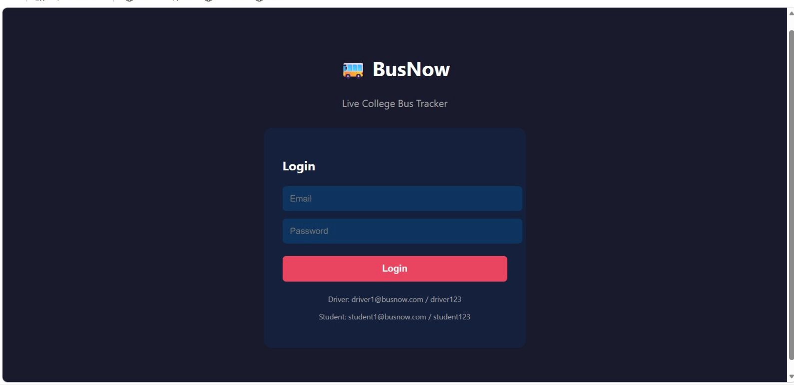
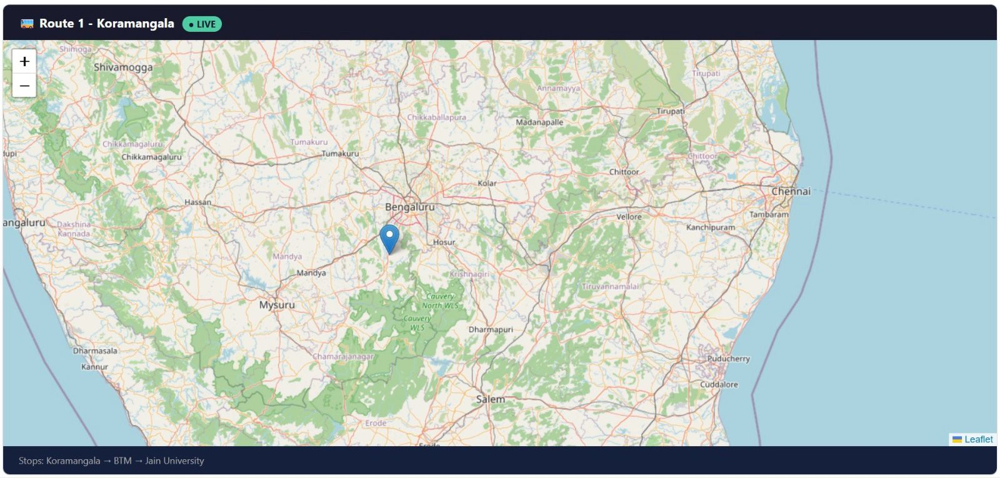
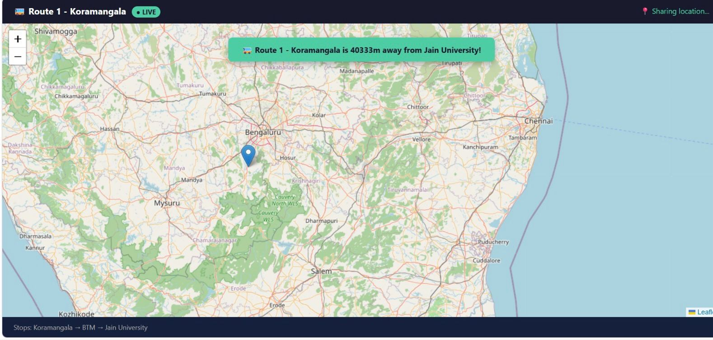

# 🚌 BusNow — Real-time College Bus Tracker

A full-stack real-time web application that allows college students to track their bus live on a map. Drivers share their GPS location and students see it update in real time.

## 📸 Screenshots

### Login Page

### Bus Selection

### Live Map

## 🌟 Features

- 🔐 **JWT Authentication** — Secure login for both drivers and students
- 🚌 **Role-based Access** — Separate experience for Driver and Student
- 🗺️ **Live Map Tracking** — Real-time bus location on interactive Leaflet map
- 📍 **Multiple Bus Routes** — Students select their specific bus route
- 🔔 **Stop Notifications** — Alert when bus is approaching your stop
- 💾 **Persistent Database** — User accounts and bus routes stored in database
- ⚡ **Real-time Updates** — Powered by Socket.io WebSockets

## 🛠️ Tech Stack

**Frontend:**
- React.js
- Leaflet.js + React-Leaflet (interactive maps)
- Socket.io-client (real-time communication)
- Axios (API calls)

**Backend:**
- Node.js + Express.js
- Socket.io (WebSocket server)
- JWT (JSON Web Tokens for authentication)
- bcryptjs (password hashing)
- NeDB (embedded database)

## 📁 Project Structure